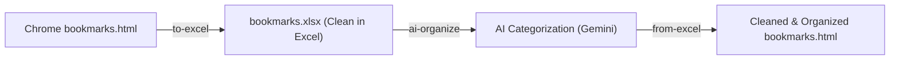

Google Gemini support has been integrated into the Bookmark Manager Organizer.

---

### What Was Done

1. **Provider Abstraction & Shared Interface** ([`src/llm_interface.py`](file:///bookmarks-organizer/src/llm_interface.py)):
   - Created the [LLMInterface](file:///bookmarks-organizer/src/llm_interface.py) abstract base class.
   - Centralized prompt creation ([build_user_prompt](file:///bookmarks-organizer/src/llm_interface.py)) and response schema validation ([validate_categorization_response](file:///bookmarks-organizer/src/llm_interface.py)) ensuring missing or malformed indices gracefully fallback to `Uncategorized`.

2. **Native Gemini Integration** ([`src/gemini_llm.py`](file:///bookmarks-organizer/src/gemini_llm.py)):
   - Implemented [GeminiLLM](file:///bookmarks-organizer/src/gemini_llm.py) using Google's official `google-genai` SDK (`google.genai.Client`).
   - Configured structured JSON generation via `types.GenerateContentConfig(response_mime_type="application/json")`.
   - Built retry logic with exponential backoff handling rate limits (`429` / `RESOURCE_EXHAUSTED`), timeouts, and transient 5xx server errors.
   - Clean text extraction handling multi-part model outputs without warnings.

3. **OpenAI Provider Refactoring** ([`src/openai_llm.py`](file:///bookmarks-organizer/src/openai_llm.py)):
   - Wrapped the OpenAI client under [OpenAILLM](file:///bookmarks-organizer/src/openai_llm.py), preserving full compatibility with OpenAI, OpenRouter, and local OpenAI-compatible endpoints (Ollama, LM Studio).

4. **Auto-Detection & Factory** ([`src/llm_factory.py`](file:///bookmarks-organizer/src/llm_factory.py)):
   - [detect_provider](file:///bookmarks-organizer/src/llm_factory.py) automatically selects `gemini` if:
     - `GEMINI_API_KEY` is present.
     - The provided key starts with Google's key prefix (`AIza...`).
     - A Gemini model is selected (e.g. `gemini-3.8-flash`).
     - `--provider gemini` is specified.
   - Defaults model to `gemini-3.8-flash` for Gemini and `gpt-4o-mini` for OpenAI.

5. **CLI & Organizer Integration** ([`main.py`](file:///bookmarks-organizer/main.py), [`src/organizer.py`](file:///bookmarks-organizer/src/organizer.py)):
   - Added `--provider {auto,gemini,openai}` CLI flag to [`main.py`](file:///bookmarks-organizer/main.py).
   - Maintained full backward compatibility in [`organize_bookmarks`](file:///bookmarks-organizer/src/organizer.py) and [`_categorize_batch`](file:///bookmarks-organizer/src/organizer.py).

6. **Configuration & Dependencies**:
   - Added `google-genai>=1.0.0` to [`requirements.txt`](file:///bookmarks-organizer/requirements.txt).
   - Updated [`.env.example`](file:///bookmarks-organizer/.env.example) and [`config.yaml`](file:///bookmarks-organizer/config.yaml).
   - Updated [`README.md`](file:////bookmarks-organizer/README.md) with Gemini setup instructions and examples.

7. **Test Suite** ([`tests/test_gemini.py`](file:///bookmarks-organizer/tests/test_gemini.py)):
   - Added 19 unit & integration tests covering client initialization, prompt generation, JSON response parsing, rate-limit retries, permanent error handling, and provider detection.
   - All 57 test cases in the test suite pass.

---

### Usage Examples

#### Run with Auto-Detection (uses your Gemini API key from `.env`)
```bash
python main.py bookmarks.html
```

#### Explicitly Specify Gemini
```bash
python main.py bookmarks.html --provider gemini --model gemini-3.8-flash
```

#### Specify Output File
```bash
python main.py bookmarks.html -o organized_bookmarks.html
```

#### Run Tests
```bash
pytest
```

Excel spreadsheet for bookmark curation directly solves the biggest friction point in bookmark organization: **reviewing clutter before feeding it to AI or importing it back into your browser.**

Opening raw HTML in a browser gives you an unwieldy list, whereas an Excel Table gives you:
- **Instant Sorting by Date**: Chrome stores timestamps as Unix epochs (e.g., `1749966118`), which are unreadable. In Excel, we format them as `YYYY-MM-DD` so you can immediately see bookmarks from 5+ years ago.
- **Bulk Cleanup**: Easily highlight and delete 50 temporary links in 5 seconds.
- **Filter by Domain/Keyword**: Filter all links from `localhost`, `reddit.com`, or obsolete intranet portals.
- **Visual Category Tweaking**: Review AI-suggested categories in a column and tweak names before writing the final HTML file.

---

### Recommended Architecture & Workflow

Integrated seamless Excel reading, writing, and round-tripping:



#### 1. The Two Ideal Workflows
1. **Pre-AI Cleanup (Primary scenario)**:
   ```bash
   python main.py bookmarks.html --to-excel bookmarks.xlsx
   ```
   - Open `bookmarks.xlsx` in Excel.
   - Sort by Date Added to delete old/temporary links.
   - Filter by Domain to remove dead services.
   - Run AI categorization directly on the cleaned Excel file (or convert back to HTML):
   ```bash
   python main.py bookmarks.xlsx -o bookmarks_organized.html
   ```
python main.py bookmarks_Test.xlsx -o bookmarks_organized.html --provider gemini
2. **Post-AI Review**:
   - Have the AI output to Excel with a `Category` column so you can review and approve folders before generating the final browser import file.

---

### Excel Table Layout

The Table in the `.xlsx` file uses a native formatted **Excel Table** with auto-filters, alternating colored rows, frozen header rows, and clickable hyperlinks:

| Folder Path | Bookmark Title | URL | Date Added | Domain | Location | Keep / Delete |
| :--- | :--- | :--- | :--- | :--- | :--- | :--- |
| `Bookmarks bar/CADD` | Download Aerial Imagery Script | `https://chatgpt.com/...` | 2025-06-15 | `chatgpt.com` | Folder | Keep |
| `Bookmarks bar` | Maps | `https://maps.google.com` | 2023-01-10 | `google.com` | **Toolbar Root** | Keep |
| `Bookmarks bar/Old` | Temporary Conference Schedule | `https://conf2021.org` | 2021-04-12 | `conf2021.org` | Folder | **Delete** |

#### Handling Your Toolbar Specifics:
1. **The "Shortened Toolbar Names" Problem**:
   - If you use short bookmark titles on the Bookmarks Bar (to maximize toolbar space = more Bookmarks), the `Location` column can clearly flag bookmarks located at `Bookmarks bar` (root) vs those nested inside folders.
   - We can add a `--preserve-toolbar` setting: keeps items directly on the toolbar untouched, ensuring any short titles aren't swallowed into folders by the AI.
2. **"Keep / Delete" or Direct Row Deletion**:
   - When importing back from Excel, you can either **simply delete the row** in Excel, or mark a `Status` column as `Delete`. Both will drop the bookmark from the resulting HTML.

---

### Added Supercharge Features

1. **Automatic Duplicate URL Detection**:
   - When generating the Excel file, we can highlight duplicate URLs (using Excel conditional formatting or a `Duplicate` column) so you can eliminate duplicates at a glance.
2. **Optional Dead Link / Domain Checker**:
   - We can add an optional `--check-links` scanner that runs fast asynchronous HTTP `HEAD` checks to flag dead sites (404, 500, or domain expired) with a `Status: Dead` column in Excel.
3. **AI Organization directly on Excel**:
   - You can run Gemini directly against the Excel file, populating a `Suggested Category` column right in your spreadsheet.

---

### Implementation Plan

Since `openpyxl` is already installed in your Python environment:
1. **[`src/excel.py`](file:///bookmarks-organizer/src/excel.py)**:
   - `export_bookmarks_to_excel(root: Folder, excel_path: Path)`: Recursively traverses the folder tree, converts timestamps, detects domains/toolbar locations, and formats an Excel table.
   - `import_bookmarks_from_excel(excel_path: Path) -> Folder`: Reads the table back, reconstructs the folder tree and Netscape metadata, skipping deleted rows.
     - Explicitly sets `cell.data_type = "s"` for all text cells. This guarantees Excel stores values like `== Bitcoin...`, `+1`, or `@username` as literal text strings (`inlineStr`), never attempting to evaluate them as formulas.
     - Safe Hyperlink Threshold**:
     - Hyperlinks are now only attached to `cell.hyperlink` if `len(url) <= 2048`. Any ultra-long URLs still display their full text in the cell, but avoid triggering Excel's hyperlink table limit.

2. **[`main.py`](file:///bookmarks-organizer/main.py)**:
   - Add CLI subcommands or flags:
     - `--to-excel [path.xlsx]`: Export HTML to Excel.
     - `--from-excel`: Read from Excel and export to HTML.
     - Accept `.xlsx` files as input directly to `main.py`!


Is the Excel data in an actual Table or some sort of a Filter in Place setting?  Converting to a table will accomplish the same thing so making it a Table may not be neccesary and I only noticed since when you are in a cell within a Table, you get the Excel Table Ribbon Menu.  Also, when working in a Table, you can right click an delete any Row from the Table.  Currently, to delete a Row, you have to select the entire row to delete it.  Another Benefit of using a Table is that you can use predefined Themes (e.g., `TableStyleMedium21`) so that you don't have to assign Fill colors, Borders, create filters, or add Sorting Controls since they are already built in. 

After performing a Sort I realized I wanted to get back to the same Orifinal Bookmark order but was unable to.  If we add an additional Informational Only Column [#] on the left side containing Bookmark # based on the input files hierarchy or listing order.  That wpuld permit users to 'restore' the original order after performing any sorting.  In addition, users would be able to quickly see where they have removed data just by the gaps in the number if that column.

Finally, I was thinking that an additional 'Informational Column" could added to the right of the table containing a formula indicating the Length of the Bookmark Name 

`bookmarks_Example_Direct_Output.xlsx` Is an example Excel mock up file that is a direct export from the Bookmarks.html file with the added Numbering Column, Excel Table named `Bookmarks` with Theme assigned, Length of Bookmark Name Column, and the following just as few more ideas:

**Number of Boomarks On Domain Column**

Table Begins on Row 2 (Header Row)

On Row 1, I add some Supplemental Information Details:

B1:	Total Bookmarks: 0
	Formula: `=COUNTA(Bookmarks[Bookmark Title])`
	Format: Tot\al \Book\m\a\rk\s\: 0
	
C1:	Max Bookmarks On Single Domain: 0
	Formula: `=MAX(Bookmarks['# Bookmarks On Domain])`
	Format: \M\ax \Book\m\a\rk\s O\n \Si\n\gl\e \Do\m\ai\n\: 0
	
D1:	Max Bookmark Name Length: 0
	Formula: `=MAX(Bookmarks[Length of Bookmark Name])`
	Format: \M\ax \Book\m\a\rk \N\a\m\e L\e\n\gt\h\: 0
	
E1:	Deleted Bookmarks: 0
	Formula: `=MAX(Bookmarks['['#']]-COUNTA(Bookmarks[Bookmark Title]))`
	Format: \D\el\et\e\d \Book\m\a\rk\s\: 0
	
F1:	Oldest: 0.00 yrs. (0.00 mo.)
	Formula: `="Oldest: "&ROUND((TODAY()-MIN(Bookmarks[Date Added]))/(365.25)/12,2)&" yrs. ("&ROUND((TODAY()-MIN(Bookmarks[Date Added]))/(365.25),2)&" mo.)"`
	Format: (in Formula)
	
G1:	Folders: 0
	Formula: `=COUNTIF(Bookmarks[Location],"=Folder")`
	Format: Fol\d\e\r\s\: 0
	
H1:	Duplicates: 0
	Formula: `=COUNTIF(Bookmarks[Duplicate],"=Yes*")`
	Format: \Duplic\at\e\s\: 0
	
I1:	Bookmarks Bar: 0
	Formula: `=COUNTIF(Bookmarks[Location],"=Toolbar Root")`
	Format: Tot\al \Book\m\a\rk\s\: 0


Date Format: yyyy-mm-dd hh:mm:ss;@

Allow for adding User Defined Categories for AI to Use as an Option.  Maybe a User Suggested Categories in the `config.yaml` or someplace conveinient.     Below is just an Idea.  ALso, I place all my Bookmarks in the `Bookmarks Bar`, then maybe have 6-8 Category Folders (shortened), and the rest that are not in the folders sirectly on the bar.

```config.yaml Example Note Final
# Provider configuration (auto, gemini, or openai)
provider: auto

# Gemini configuration
gemini_model: gemini-3.8-flash

# OpenAI / OpenAI-compatible configuration
model: gpt-4o-mini

# Categorization options
max_categories: 20
batch_size: 10
preserve_toolbar: true  # Keep bookmarks directly on the Bookmarks Bar intact (preserves short titles and shorten when possible)
root_folder: Bookmarks bar  # Keep all bookmarks within the `Bookmarks bar`
toolbar_Bookmarks_max_length: 6
toolbar_max_folders: 8
toolbar_max_folder_Nesting: 4

protected_folders:
  - Favorites
  - Reading List

suggested_categories: `Bookmarks bar/AI Prompts`, `Bookmarks bar/AI Prompts/*`, `Bookmarks bar/Finance`, `Bookmarks bar/Finance/Crypto`,  `Bookmarks bar/Finance/Credit`, `Bookmarks bar/GIS & Mapping`, `Bookmarks bar/Employment`
```


Listed directory bookmarks-organizer
Ran command: `python -c "
import openpyxl

wb = openpyxl.load_workbook('bookmarks_Example_Direct_Output.xlsx', data_only=False)
ws = wb.active
print('Sheet title:', ws.title)
print('Tables in sheet:', [t.name for t in ws.tables.values()])
for t in ws.tables.values():
    print('Table Name:', t.name, 'Ref:', t.ref, 'Style:', t.tableStyleInfo.name if t.tableStyleInfo else None)
    print('Table cols:', [c.name for c in t.tableColumns])

print('\nRow 1 values:')
for col in range(1, 15):
    c = ws.cell(row=1, column=col)
    if c.value is not None:
        print(f'R1C{col} ({openpyxl.utils.get_column_letter(col)}1): value={repr(c.value)}, number_format={repr(c.number_format)}')

print('\nRow 2 (Headers):')
for col in range(1, ws.max_column + 1):
    c = ws.cell(row=2, column=col)
    print(f'R2C{col} ({openpyxl.utils.get_column_letter(col)}2): {repr(c.value)}')

print('\nRow 3 (Sample Data):')
for col in range(1, ws.max_column + 1):
    c = ws.cell(row=3, column=col)
    print(f'R3C{col} ({openpyxl.utils.get_column_letter(col)}3): value={repr(c.value)}, number_format={repr(c.number_format)}, data_type={c.data_type}')
"`
Ran command: `python -c "
import openpyxl

wb = openpyxl.load_workbook('bookmarks_Example_Direct_Output.xlsx', data_only=False)
ws = wb.active
for col in ['B1', 'C1', 'D1', 'E1', 'F1', 'G1', 'H1', 'I1', 'J1']:
    c = ws[col]
    val = getattr(c.value, 'text', c.value)
    print(f'{col}: val={repr(val)}, fmt={repr(c.number_format)}')
"`
Ran command: `python -c "
import openpyxl

wb = openpyxl.load_workbook('bookmarks_Example_Direct_Output.xlsx', data_only=False)
ws = wb.active
for col in ['B1', 'C1', 'D1', 'E1', 'F1', 'G1', 'H1', 'I1']:
    c = ws[col]
    font = (c.font.name, c.font.size, c.font.bold, c.font.color.rgb if c.font.color else None)
    fill = c.fill.fill_type
    align = (c.alignment.horizontal, c.alignment.vertical)
    print(f'{col}: font={font}, fill={fill}, align={align}')
print('Row 1 height:', ws.row_dimensions[1].height)
print('Row 2 height:', ws.row_dimensions[2].height)
print('Freeze panes:', ws.freeze_panes)
"`
Ran command: `python -c "
import openpyxl

wb = openpyxl.load_workbook('bookmarks_Example_Direct_Output.xlsx', data_only=False)
ws = wb.active
for col_idx in range(1, 13):
    col_letter = openpyxl.utils.get_column_letter(col_idx)
    dim = ws.column_dimensions[col_letter]
    print(f'{col_letter}: width={dim.width}')
"`
Ran command: `python -c "
import openpyxl

wb = openpyxl.load_workbook('bookmarks_Example_Direct_Output.xlsx', data_only=False)
ws = wb.active
for r in range(3, 8):
    c = ws.cell(row=r, column=5)
    print(f'Row {r} Date Added: val={repr(c.value)}, type={c.data_type}')
"`
Ran command: `python -c "
import openpyxl

wb = openpyxl.load_workbook('bookmarks_Example_Direct_Output.xlsx', data_only=True)
ws = wb.active
for col in ['B1', 'C1', 'D1', 'E1', 'F1', 'G1', 'H1', 'I1']:
    print(f'{col}: val={repr(ws[col].value)}')
print('Row 3 Date Added data_only:', repr(ws['E3'].value))
"`
Ran command: `python -c "
import openpyxl

wb = openpyxl.load_workbook('bookmarks_Example_Direct_Output.xlsx', data_only=False)
ws = wb.active
print('F1 formula:', repr(ws['F1'].value))
"`
Ran command: `python -c "
import openpyxl

wb = openpyxl.load_workbook('bookmarks_Example_Direct_Output.xlsx', data_only=False)
print('F1 formula:', wb.active['F1'].value)
wb2 = openpyxl.load_workbook('bookmarks_Example_Direct_Output.xlsx', data_only=True)
print('F1 cached value:', wb2.active['F1'].value)
"`
Ran command: `python -c "
import openpyxl

wb = openpyxl.load_workbook('bookmarks_Example_Direct_Output.xlsx', data_only=False)
ws = wb.active
for t in ws.tables.values():
    print('name:', t.name)
    print('displayName:', t.displayName)
    print('ref:', t.ref)
    print('headerRowCount:', t.headerRowCount)
    print('style name:', t.tableStyleInfo.name)
    print('showRowStripes:', t.tableStyleInfo.showRowStripes)
    print('showColumnStripes:', t.tableStyleInfo.showColumnStripes)
    print('showFirstColumn:', t.tableStyleInfo.showFirstColumn)
    print('showLastColumn:', t.tableStyleInfo.showLastColumn)
"`
Ran command: `python -c "
import openpyxl

wb = openpyxl.load_workbook('bookmarks_Example_Direct_Output.xlsx', data_only=False)
c = wb.active['E1']
print('type:', type(c.value), 'text:', getattr(c.value, 'text', None), 'ref:', getattr(c.value, 'ref', None))
"`
Viewed excel.py:1-75
Ran command: `python -c "
import openpyxl
from openpyxl.worksheet.table import Table, TableStyleInfo
from openpyxl.worksheet.formula import ArrayFormula

wb = openpyxl.Workbook()
ws = wb.active
ws.title = 'Bookmarks'

# Row 1 KPIs
ws['B1'] = '=COUNTA(Bookmarks[Bookmark Title])'
ws['B1'].number_format = r'\T\o\t\a\l\ \B\o\o\k\m\a\r\k\s\:\ 0'

ws['C1'] = \"=MAX(Bookmarks['# Bookmarks On Domain])\"
ws['C1'].number_format = r'\M\a\x\ \B\o\o\k\m\a\r\k\s\ \O\n\ \S\i\n\g\l\e\ \D\o\m\a\i\n\:\ 0'

ws['D1'] = '=MAX(Bookmarks[Length of Bookmark Name])'
ws['D1'].number_format = r'\M\a\x\ \B\o\o\k\m\a\r\k\ \N\a\m\e\ \L\e\n\g\t\h\:\ 0'

ws['E1'] = ArrayFormula(ref='E1', text=\"=MAX(Bookmarks['['#']]-COUNTA(Bookmarks[Bookmark Title]))\")
ws['E1'].number_format = r'\D\e\l\e\t\e\d\ \B\o\o\k\m\a\r\k\s\:\ 0'

ws['F1'] = '=\"Oldest: \"&ROUND((TODAY()-MIN(Bookmarks[Date Added]))/(365.25)/12,2)&\" yrs. (\"&ROUND((TODAY()-MIN(Bookmarks[Date Added]))/(365.25),2)&\" mo.)\"'

ws['G1'] = '=COUNTIF(Bookmarks[Location],\"=Folder\")'
ws['G1'].number_format = r'\F\o\l\d\e\r\s\:\ 0'

ws['H1'] = '=COUNTIF(Bookmarks[Duplicate],\"=Yes*\")'
ws['H1'].number_format = r'\D\u\p\l\i\c\a\t\e\s\:\ 0'

ws['I1'] = '=COUNTIF(Bookmarks[Location],\"=Toolbar Root\")'
ws['I1'].number_format = r'\B\o\o\k\m\a\r\k\s\ \B\a\r\:\ 0'

headers = ['[#]', 'Folder Path', 'Bookmark Title', 'URL', 'Date Added', 'Domain', 'Location', 'Duplicate', 'Status', 'Raw Add Date', 'Length of Bookmark Name', '# Bookmarks On Domain']
ws.append(headers)

row_data = [
    1,
    'Bookmarks bar/Dev',
    'GitHub',
    'https://github.com',
    '=TEXT(Bookmarks[[#This Row],[Raw Add Date]]/86400 + 25569, \"yyyy-mm-dd hh:mm:ss\")',
    'github.com',
    'Folder',
    'No',
    'Keep',
    '1693701459',
    '=LEN(Bookmarks[[#This Row],[Bookmark Title]])',
    '=COUNTIF(Bookmarks[Domain],Bookmarks[[#This Row],[Domain]])',
]
ws.append(row_data)

tab = Table(name='Bookmarks', displayName='Bookmarks', ref='A2:L3')
tab.tableStyleInfo = TableStyleInfo(name='TableStyleMedium21', showFirstColumn=False, showLastColumn=False, showRowStripes=True, showColumnStripes=False)
ws.add_table(tab)

wb.save('test_table.xlsx')
print('Table created successfully!')
"`
Created excel.py
Viewed organizer.py:25-85
Viewed organizer.py:180-209
Edited organizer.py
Viewed organizer.py:190-216
Edited organizer.py
Viewed main.py:50-85
Viewed main.py:160-220
Edited main.py
Viewed main.py:195-235
Edited main.py
Created config.yaml
Viewed test_excel.py:60-140
Viewed test_excel.py:140-201
Created test_excel.py
Ran command: `pytest`
Viewed task-371.log:1-9
Viewed task-371.log:1-22
Ran command: `python main.py bookmarks.html --to-excel bookmarks.xlsx`
Viewed task-378.log:1-4
Ran command: `python -c "
import openpyxl

wb = openpyxl.load_workbook('bookmarks.xlsx', data_only=False)
ws = wb.active
print('Table:', [t.name for t in ws.tables.values()])
t = ws.tables['Bookmarks']
print('Ref:', t.ref, 'Style:', t.tableStyleInfo.name)
print('Headers Row 2:', [ws.cell(row=2, column=c).value for c in range(1, 13)])
print('KPIs Row 1:')
for c in range(2, 11):
    cell = ws.cell(row=1, column=c)
    val = getattr(cell.value, 'text', cell.value)
    print(f'  {openpyxl.utils.get_column_letter(c)}1: {val} (fmt: {cell.number_format})')
print('Data Row 3:', [ws.cell(row=3, column=c).value for c in range(1, 13)])
print('Data Row 4:', [ws.cell(row=4, column=c).value for c in range(1, 13)])
"`
Ran command: `python main.py bookmarks.xlsx -o test_from_excel.html --no-ai`
Ran command: `powershell -Command "Remove-Item -Path test_from_excel.html -Force"`
Ran command: `git status`

The Excel export engine and AI categorization have been upgraded to match your exact mockup from `bookmarks_Example_Direct_Output.xlsx`.

[`bookmarks.xlsx`](file:///c:/Users/jlggps/Documents/Bookmarks/bookmarks-organizer/bookmarks.xlsx) has been re-generated with the full native Excel Table, KPI summary row, restore column, and analytical formulas.

---

### What Was Added & Upgraded

#### 1. Official Native Excel Table (`TableStyleMedium21`)
- Converted from a simple auto-filter to an official **Excel `ListObject` Table named `Bookmarks`**.
- Features full Excel Table integration:
  - Table Ribbon Menu enabled in Excel.
  - Right-click any cell $\rightarrow$ **Delete** $\rightarrow$ **Table Rows**.
  - Built-in theme styling with alternating row stripes.

#### 2. Row 1 KPI Summary Cards
Table headers now sit on **Row 2**, and **Row 1** displays dynamic summary metrics that update automatically as you filter or delete rows:

| Cell | Metric | Formula | Number Format |
| :--- | :--- | :--- | :--- |
| **B1** | **Total Bookmarks** | `=COUNTA(Bookmarks[Bookmark Title])` | `Total Bookmarks: 0` |
| **C1** | **Max on Single Domain** | `=MAX(Bookmarks['# Bookmarks On Domain])` | `Max Bookmarks On Single Domain: 0` |
| **D1** | **Max Name Length** | `=MAX(Bookmarks[Length of Bookmark Name])` | `Max Bookmark Name Length: 0` |
| **E1** | **Deleted Bookmarks** | `=MAX(Bookmarks['['#']]-COUNTA(Bookmarks[Bookmark Title]))` | `Deleted Bookmarks: 0` |
| **F1** | **Oldest Bookmark** | `="Oldest: "&ROUND((TODAY()-MIN(Bookmarks[Date Added]))/(365.25)/12,2)&" yrs. ("&ROUND((TODAY()-MIN(Bookmarks[Date Added]))/(365.25),2)&" mo.)"` | General |
| **G1** | **Folder Count** | `=COUNTIF(Bookmarks[Location],"=Folder")` | `Folders: 0` |
| **H1** | **Duplicate Count** | `=COUNTIF(Bookmarks[Duplicate],"=Yes*")` | `Duplicates: 0` |
| **I1** | **Bookmarks Bar Count** | `=COUNTIF(Bookmarks[Location],"=Toolbar Root")` | `Bookmarks Bar: 0` |
| **J1** | **Oldest (Months)** | `=(TODAY()-MIN(Bookmarks[Date Added]))/365.25` | `Oldest: 0.00 mo.` |

- **Freeze Panes** is set to `A3`: keeps both the **KPI Cards (Row 1)** and the **Table Headers (Row 2)** visible while you scroll.

#### 3. Restore-Order Index Column `[#]`
- Column 1 (`A`) contains the sequential 1-based index (`1, 2, 3...`) reflecting the original bookmark order from your browser export.
- **Restore original order anytime**: Simply sort Column `A` ascending.
- **Spot deletions**: Gaps in the sequence make it immediately obvious where bookmarks have been removed.

#### 4. Additional Analytical Columns
- **`Length of Bookmark Name` (Col K)**: Uses `=LEN(Bookmarks[[#This Row],[Bookmark Title]])` to identify bookmarks that are too long for toolbar width.
- **`# Bookmarks On Domain` (Col L)**: Uses `=COUNTIF(Bookmarks[Domain],Bookmarks[[#This Row],[Domain]])` to find domains you have bookmarked repeatedly.
- **`Date Added` (Col E)**: Uses `=TEXT(Bookmarks[[#This Row],[Raw Add Date]]/86400 + 25569, "yyyy-mm-dd hh:mm:ss")` with format `yyyy-mm-dd hh:mm:ss;@`.

#### 5. User-Defined Categories & Toolbar Rules in [`config.yaml`](file:///c:/Users/jlggps/Documents/Bookmarks/bookmarks-organizer/config.yaml)
Updated [`config.yaml`](file:///c:/Users/jlggps/Documents/Bookmarks/bookmarks-organizer/config.yaml) with your specified settings:
```yaml
root_folder: Bookmarks bar          # Keep all organized folders within the Bookmarks Bar
preserve_toolbar: true              # Keep direct toolbar links intact with their short titles
toolbar_Bookmarks_max_length: 6     # Target title length for direct toolbar bookmarks
toolbar_max_folders: 8              # Target maximum main folders on the bar
toolbar_max_folder_Nesting: 4       # Max folder nesting depth

suggested_categories:
  - Bookmarks bar/AI Prompts
  - Bookmarks bar/Finance
  - Bookmarks bar/Finance/Crypto
  - Bookmarks bar/Finance/Credit
  - Bookmarks bar/GIS & Mapping
  - Bookmarks bar/Employment
```
- [`main.py`](file:///c:/Users/jlggps/Documents/Bookmarks/bookmarks-organizer/main.py#L70) passes these suggested categories directly into the AI prompt so Gemini strongly prioritizes placing bookmarks into these folders first.
- [`build_organized_tree`](file:///c:/Users/jlggps/Documents/Bookmarks/bookmarks-organizer/src/organizer.py#L200) automatically constructs the nested subfolder hierarchy (e.g. `Bookmarks bar` $\rightarrow$ `Finance` $\rightarrow$ `Crypto`).

---

### Verification
- Re-exported [`bookmarks.xlsx`](file:///c:/Users/jlggps/Documents/Bookmarks/bookmarks-organizer/bookmarks.xlsx) (642 bookmarks, table range `A2:L644`).
- Tested round-trip import from Excel back to HTML without AI: works cleanly.
- All 66 tests pass.